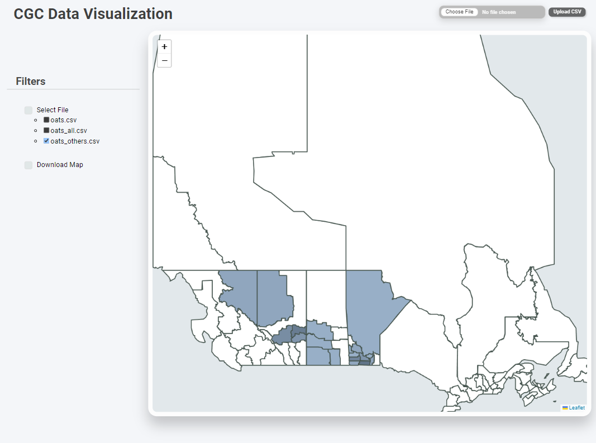

    <h1> CGC Data Visualization Tool </h1>
    

## 
CGC-DataVizTool is a web-based program that simplifies and improves the display of agricultural data for the **Canadian Grain Commission**. 

## Features
- Works to convert complicated data sets into intuitive, interactive, and informative visual representations.
- Focus on time series and geographic data analysis.
